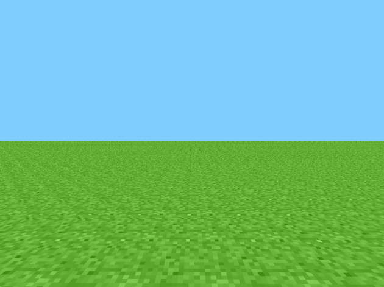

# rd-132211 (Pre-Classic)
Development phase: May 13, 2009 (19:00 - 22:11 UTC+2)

 
Level image from the recreation

## Changes
- Placing & Destroying tiles
- Added a flashing white overlay which displays on the side of a block that the player has their mouse
- Level can be saved by pressing "Enter"

## References
- [Minecraft Wiki - Java_Edition_pre-Classic_rd-132211](https://minecraft.gamepedia.com/Java_Edition_pre-Classic_rd-132211)

## Setup
1. Clone the project
2. Set the VM option ``-Dorg.lwjgl.librarypath="<path_to_project>/run/natives"``
3. Set the working directory to ``./run``